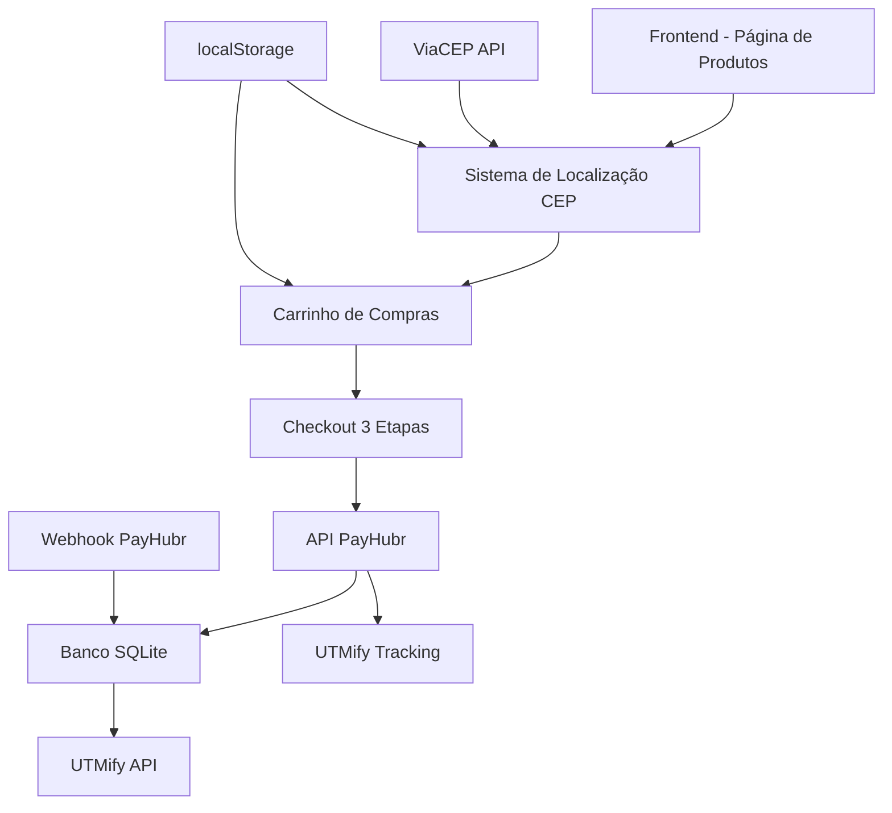

# Design Document

## Overview

Este documento descreve o design técnico para a evolução do sistema atual de cardápio digital, transformando-o em uma plataforma completa de e-commerce com página de produtos, sistema de localização por CEP, checkout em 3 etapas e integração completa com pagamento PIX via UTMify. O design mantém a base existente e adiciona as funcionalidades necessárias de forma incremental.

## Architecture

### Arquitetura Geral



### Fluxo de Dados Principal

1. **Inicialização**: Sistema verifica cache de endereço
2. **Localização**: Modal CEP → ViaCEP API → Cache localStorage
3. **Produtos**: Carregamento dinâmico dos produtos reais
4. **Carrinho**: Gestão local com persistência
5. **Checkout**: 3 etapas com validação progressiva
6. **Pagamento**: PayHubr → SQLite → UTMify (pendente/pago)

## Components and Interfaces

### 1. Sistema de Localização por CEP

#### Componente: `LocationManager`

**Responsabilidades:**
- Gerenciar modais de localização
- Integrar com ViaCEP API
- Persistir endereço no localStorage
- Calcular distância simulada

**Interface:**
```javascript
class LocationManager {
    constructor() {
        this.endereco = null;
        this.cacheKey = 'endereco_cliente';
    }
    
    async verificarCache()
    async solicitarCEP()
    async consultarViaCEP(cep)
    async solicitarNumero(dadosEndereco)
    salvarEndereco(enderecoCompleto)
    exibirConfirmacao()
}
```

**Integração ViaCEP:**
```javascript
// Endpoint: https://viacep.com.br/ws/{cep}/json/
// Resposta esperada:
{
    "cep": "01310-100",
    "logradouro": "Avenida Paulista",
    "bairro": "Bela Vista",
    "localidade": "São Paulo",
    "uf": "SP"
}
```

### 2. Sistema de Produtos

#### Componente: `ProductManager`

**Responsabilidades:**
- Carregar produtos reais substituindo exemplos
- Renderizar categorias dinamicamente
- Gerenciar badges e promoções
- Calcular preços com desconto

**Estrutura de Dados:**
```javascript
const frutasDoAmor = [
    {
        id: 'kit-3-morangos',
        nome: 'Kit 3 morangos do amor',
        tipo: 'morango',
        tamanho: 'Grande',
        quantidade: 3,
        precoOriginal: 29.80,
        precoPromocional: 19.99,
        categoria: 'frutas-do-amor',
        imagem: 'path/to/image.jpg',
        disponivel: true,
        maisVendido: false,
        descricao: 'Deliciosos morangos do amor cobertos com chocolate'
    }
    // ... outros produtos
];
```

### 3. Sistema de Carrinho

#### Componente: `CartManager`

**Responsabilidades:**
- Adicionar/remover produtos
- Calcular totais
- Persistir estado
- Exibir resumo

**Interface:**
```javascript
class CartManager {
    constructor() {
        this.itens = [];
        this.total = 0;
    }
    
    adicionarItem(produto, quantidade)
    removerItem(produtoId)
    atualizarQuantidade(produtoId, quantidade)
    calcularTotal()
    obterResumo()
    limpar()
}
```

### 4. Sistema de Checkout

#### Componente: `CheckoutManager`

**Responsabilidades:**
- Gerenciar 3 etapas do checkout
- Validar dados do usuário
- Integrar com sistema de pagamento
- Preservar parâmetros UTM

**Etapas:**

**Etapa 1 - Dados Pessoais:**
```javascript
{
    nome: string,        // Solicitado ao usuário
    telefone: string,    // Solicitado ao usuário
    email: string,       // Gerado: "clienteteste@gmail.com"
    cpf: string         // Gerado via função gerarCPF()
}
```

**Etapa 2 - Confirmação de Endereço:**
```javascript
{
    endereco: {
        cep: string,
        logradouro: string,
        numero: string,     // Solicitado anteriormente
        bairro: string,
        cidade: string,
        uf: string
    }
}
```

**Etapa 3 - Pagamento PIX:**
```javascript
{
    transactionId: string,
    pixCode: string,
    qrCodeUrl: string,
    valor: number,
    status: 'pending' | 'paid' | 'canceled'
}
```

### 5. Sistema de Pagamento PIX

#### Integração com PayHubr API

**Endpoint:** `checkout/pagamento.php`

**Fluxo:**
1. Recebe dados do checkout
2. Gera CPF válido automaticamente
3. Cria transação via PayHubr
4. Salva no SQLite
5. Envia para UTMify (pendente)
6. Retorna PIX code e QR code

**Estrutura de Dados:**
```php
$data = [
    "paymentMethod" => "PIX",
    "amount" => $valor_centavos,
    "items" => [...],
    "utmQuery" => $utmQuery,
    "name" => $nome_cliente,
    "email" => "clienteteste@gmail.com",
    "cpf" => $cpf_gerado,
    "phone" => $telefone_usuario
];
```

### 6. Sistema de Rastreamento UTMify

#### Componente: `UTMTracker`

**Responsabilidades:**
- Capturar parâmetros UTM da URL
- Preservar durante todo o fluxo
- Enviar para UTMify em momentos específicos

**Parâmetros Rastreados:**
```javascript
const utmParams = {
    utm_source: string,
    utm_medium: string,
    utm_campaign: string,
    utm_content: string,
    utm_term: string,
    xcod: string,
    sck: string,
    fbclid: string,
    gclid: string,
    ttclid: string
};
```

**Fluxo UTMify:**
1. **Pendente:** `utmify-pendente.php` (status: waiting_payment)
2. **Pago:** `utmify.php` (status: paid)

## Data Models

### 1. Produto
```javascript
interface Produto {
    id: string;
    nome: string;
    tipo?: string;
    tamanho?: string;
    quantidade?: number;
    precoOriginal?: number;
    precoPromocional?: number;
    preco: number;
    categoria: string;
    subcategoria?: string;
    imagem: string;
    disponivel: boolean;
    maisVendido?: boolean;
    destaque?: boolean;
    descricao?: string;
    peso?: string;
    promocao?: string;
    motivoEscolha?: string;
}
```

### 2. Combo Especial
```javascript
interface ComboEspecial extends Produto {
    produtos: string[];  // IDs dos produtos inclusos
    desconto: number;    // percentual
    motivoEscolha: string;
}
```

### 3. Item do Carrinho
```javascript
interface ItemCarrinho {
    produto: Produto;
    quantidade: number;
    subtotal: number;
}
```

### 4. Endereço
```javascript
interface Endereco {
    cep: string;
    logradouro: string;
    numero: string;
    bairro: string;
    cidade: string;
    uf: string;
    complemento?: string;
}
```

### 5. Dados do Cliente
```javascript
interface DadosCliente {
    nome: string;
    telefone: string;
    email: string;      // Gerado automaticamente
    cpf: string;        // Gerado automaticamente
    endereco: Endereco;
}
```

### 6. Transação
```javascript
interface Transacao {
    id: string;
    status: 'pending' | 'paid' | 'canceled';
    valor: number;
    cliente: DadosCliente;
    itens: ItemCarrinho[];
    pixCode?: string;
    qrCodeUrl?: string;
    utmParams: object;
    createdAt: string;
    updatedAt?: string;
}
```

## Error Handling

### 1. Tratamento de Erros de API

**ViaCEP API:**
```javascript
try {
    const response = await fetch(`https://viacep.com.br/ws/${cep}/json/`);
    const data = await response.json();
    
    if (data.erro) {
        throw new Error('CEP não encontrado');
    }
    
    return data;
} catch (error) {
    this.exibirErro('Erro ao consultar CEP. Verifique e tente novamente.');
}
```

**PayHubr API:**
```javascript
try {
    const response = await fetch('checkout/pagamento.php', {
        method: 'POST',
        headers: { 'Content-Type': 'application/json' },
        body: JSON.stringify(dadosPagamento)
    });
    
    const result = await response.json();
    
    if (!result.success) {
        throw new Error(result.message || 'Erro ao processar pagamento');
    }
    
    return result;
} catch (error) {
    this.exibirErro('Erro ao gerar PIX. Tente novamente.');
}
```

### 2. Validação de Dados

**Validação de Telefone:**
```javascript
function validarTelefone(telefone) {
    const regex = /^\(\d{2}\)\s\d{4,5}-\d{4}$/;
    return regex.test(telefone);
}
```

**Validação de CEP:**
```javascript
function validarCEP(cep) {
    const regex = /^\d{5}-?\d{3}$/;
    return regex.test(cep);
}
```

### 3. Estados de Loading

```javascript
class LoadingManager {
    mostrarLoading(elemento, mensagem) {
        elemento.innerHTML = `
            <div class="loading-spinner"></div>
            <p>${mensagem}</p>
        `;
    }
    
    ocultarLoading(elemento, conteudoOriginal) {
        elemento.innerHTML = conteudoOriginal;
    }
}
```

## Testing Strategy

### 1. Testes Unitários

**Componentes a Testar:**
- `LocationManager`: Validação de CEP, cache, integração ViaCEP
- `ProductManager`: Carregamento de produtos, cálculo de preços
- `CartManager`: Operações de carrinho, cálculos
- `CheckoutManager`: Validações, fluxo de etapas
- `UTMTracker`: Captura e preservação de parâmetros

### 2. Testes de Integração

**Fluxos a Testar:**
- Fluxo completo: CEP → Produtos → Carrinho → Checkout → PIX
- Integração ViaCEP API
- Integração PayHubr API
- Webhook de pagamento
- Comunicação com UTMify

### 3. Testes de Interface

**Cenários a Testar:**
- Responsividade em diferentes dispositivos
- Transições entre modais
- Estados de loading
- Mensagens de erro
- Validação de formulários

### 4. Testes de Dados

**Validações a Testar:**
- Geração de CPF válido
- Persistência no localStorage
- Integridade dos dados no SQLite
- Preservação de parâmetros UTM

## Performance Considerations

### 1. Otimizações de Carregamento

- **Lazy Loading:** Imagens de produtos carregadas sob demanda
- **Cache de Produtos:** Produtos carregados uma vez e mantidos em memória
- **Debounce:** Validação de CEP com delay para evitar requisições excessivas

### 2. Otimizações de Banco

- **Índices SQLite:** Índice em `transaction_id` para consultas rápidas
- **Limpeza Automática:** Remoção de transações antigas periodicamente

### 3. Otimizações de API

- **Timeout Configurado:** 30 segundos para requisições PayHubr
- **Retry Logic:** Tentativas automáticas em caso de falha temporária
- **Rate Limiting:** Controle de frequência de requisições

## Security Considerations

### 1. Validação de Dados

- **Sanitização:** Todos os inputs do usuário sanitizados
- **Validação Server-Side:** Validações críticas no backend
- **CSRF Protection:** Tokens CSRF em formulários sensíveis

### 2. Proteção de APIs

- **Rate Limiting:** Limite de requisições por IP
- **Input Validation:** Validação rigorosa de parâmetros
- **Error Handling:** Não exposição de informações sensíveis

### 3. Dados Sensíveis

- **CPF Gerado:** CPFs válidos mas fictícios
- **Logs Seguros:** Não log de dados sensíveis
- **HTTPS Only:** Todas as comunicações via HTTPS

## Integration Points

### 1. ViaCEP API
- **Endpoint:** `https://viacep.com.br/ws/{cep}/json/`
- **Rate Limit:** Sem limite oficial, mas uso responsável
- **Fallback:** Formulário manual em caso de falha

### 2. PayHubr API
- **Endpoint:** Configurado em `pagamento.php`
- **Authentication:** Secret key existente
- **Webhook:** `webhook.php` para atualizações de status

### 3. UTMify API
- **Endpoint:** `https://api.utmify.com.br/api-credentials/orders`
- **Authentication:** Token existente
- **Eventos:** Pendente e Pago

### 4. Banco SQLite
- **Arquivo:** `checkout/database.sqlite`
- **Tabela:** `pedidos` (existente)
- **Operações:** INSERT, UPDATE, SELECT

## Migration Strategy

### 1. Fase 1: Substituição do Sistema de Localização
- Substituir modais estado/cidade por modal CEP
- Implementar integração ViaCEP
- Migrar cache para localStorage

### 2. Fase 2: Atualização de Produtos
- Substituir produtos de exemplo por produtos reais
- Implementar estrutura de categorias
- Adicionar badges e promoções

### 3. Fase 3: Implementação do Checkout
- Criar fluxo de 3 etapas
- Integrar com sistema de pagamento existente
- Implementar validações

### 4. Fase 4: Integração Completa
- Conectar todos os componentes
- Testes de integração
- Otimizações de performance

## Deployment Considerations

### 1. Arquivos a Modificar
- `index.html`: Estrutura dos novos modais
- `app.js`: Lógica principal atualizada
- `config.js`: Produtos reais
- `styles.css`: Estilos dos novos componentes

### 2. Arquivos a Manter
- `checkout/`: Toda a estrutura de pagamento existente
- `checkout/database.sqlite`: Banco de dados
- `checkout/logs/`: Sistema de logs

### 3. Configurações
- Verificar permissões de escrita no SQLite
- Configurar CORS se necessário
- Validar tokens de API

### 4. Monitoramento
- Logs de erro em `checkout/logs/`
- Monitoramento de transações no SQLite
- Acompanhamento via UTMify dashboard